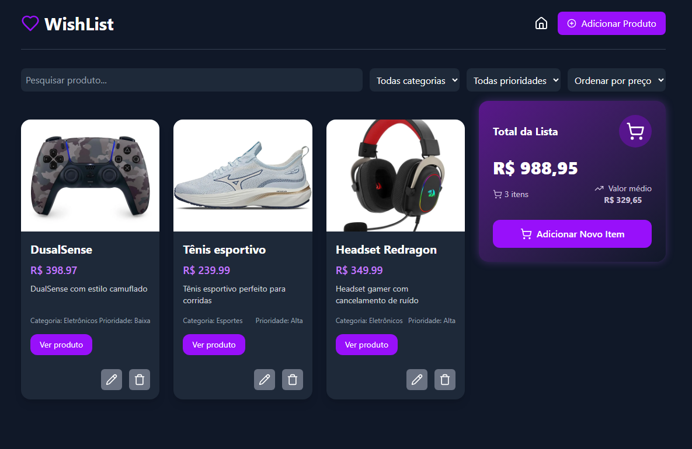

# 💜 WishList

> "Have you ever thought about being able to centralize all your products from different stores? Here is WishList"

WishList is a modern and interactive web app to organize, filter, and manage all your desired products in one place — no matter the store!  
Add, edit, and remove products, set priorities, filter by category, and keep your wish list always at hand.



---

## 🚀 Features

- **Centralize your products** from any store, with image, link, price, and description.
- **Add images** via URL or directly from your device.
- **Filter and search** by name, category, priority, and price.
- **Autocomplete** for quick product search.
- **Responsive design** for desktop and mobile.
- **Persistent data**: your list is saved in your browser.
- **Modern UI** with beautiful gradients and icons.

---

## 🖼️ Demo

> Try it live: [https://wishlist-henna.vercel.app/](#)

---

## ✨ Getting Started

1. **Clone the repository:**
   ```bash
   git clone https://github.com/malopez23/wishlist.git
   cd wishlist
   ```

2. **Install dependencies:**
   ```bash
   npm install
   ```

3. **Run locally:**
   ```bash
   npm run dev
   ```

4. **Open in your browser:**  
   [http://localhost:5173](http://localhost:5173)

---

## 🛠️ Tech Stack

- [React](https://react.dev/)
- [TypeScript](https://www.typescriptlang.org/)
- [Vite](https://vitejs.dev/)
- [Tailwind CSS](https://tailwindcss.com/)
- [Lucide Icons](https://lucide.dev/)

---

## 📱 Mobile Friendly

WishList is fully responsive and works great on your phone, tablet, or desktop!

---

## 📦 Project Structure

```
src/
  assets/           # Images and icons
  components/       # React components (ProductCard, ProductForm, Modal, etc)
  data/             # (Optional) Mock data
  pages/            # Main pages (Home)
  types/            # TypeScript types
  App.tsx
  main.tsx
```

---

## 📝 License

MIT

---

Made with 💜 by [Marcelo Lopez](https://github.com/malopez23)